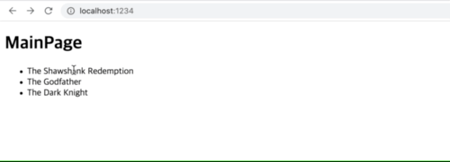

# examples Demo

You can use `sangyoon-ui` to implement the following projects.

## Step 1. Counter

using `ui`

---

## Step 2. TodoList

using `ui`

---

## Step 3. Movie-SPA

using `ui`, `router`

---

## Step 4. Cart-SPA

using `ui`, `router`, `flux`

